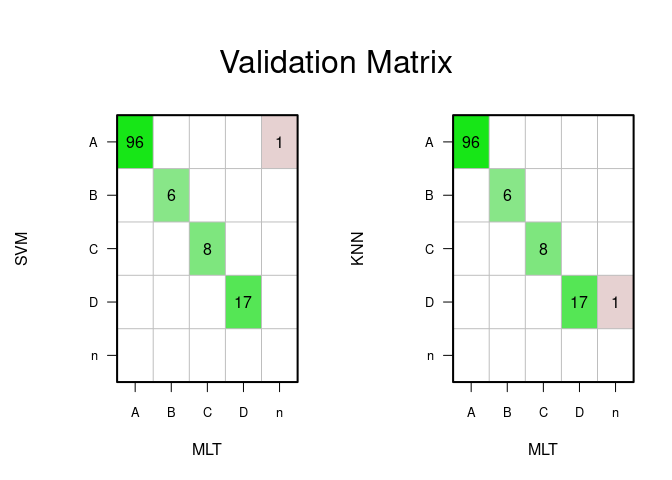
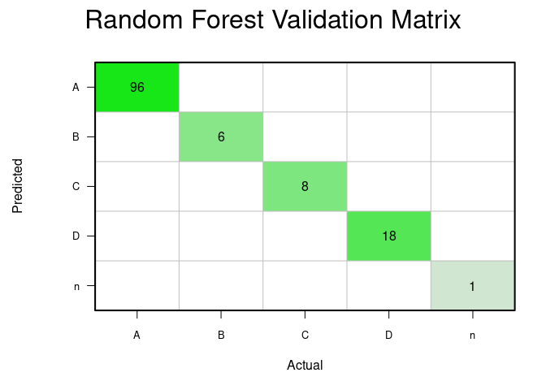

Building a new model to assess HPV16 lineage
================
Laura Asensio Puig
24/02/2022

``` r
knitr::opts_chunk$set(fig.path='Figs/')
```

## Load and prepare datasets

To build the model we collected samples from NCBI webpage (n = xxx) and
from a reference dataset obtained from xxx (n = xxx). Lineage was
assessed by the current method called Maximum Likelihood Tree (MLT) and
saved in a file called PHENODATA.csv. To the dataset, a new sequence
called the “n” sequence was added. This sequence is a “no-information
sample”, which will be used to assess poor coverage samples in the “n”
group instead to misclassify them in a lineage group.

``` r
##########################################
####        LOAD & PREPARE DATA       ####
##########################################

# Define your own path
# PC_path <- "~PATH"

#Load libraries
suppressMessages(library(seqinr)) #read fasta
suppressMessages(library(forcats)) #fct_rev
suppressMessages(library(FactoMineR)) #MCA
suppressMessages(library(factoextra)) #plot MCA 
suppressMessages(library(caret)) #training test algorithms
suppressMessages(library(epitools)) #OR function
suppressMessages(library(gtools)) #create combinations of letters
suppressMessages(library(evaluate)) #save warning messages 
suppressMessages(library(xtable)) #create tables
suppressMessages(library(RColorBrewer)) # palette colors
suppressMessages(library(viridis)) # palette colors
suppressMessages(library(kableExtra)) # nice tables
suppressMessages(library(scales)) #write in scientific notation

# Load internal functions
source(paste(PC_path, "Codes/", "Functions.R", sep = "/"))

# Define colors 
col_cc <- c("#EE7E33", "#9cc653") #For case/control variable
col_lin <- viridis(5) #For Lineage
col_sublin <- viridis(13) #For Sublineage

### Organize Folders ###
# PATH/
# - Codes/
#     -Functions.R
# - Data/
#     -PHENODATA.csv
#     -Aligned/
#       - Aligned_samples.fasta (or .Rdata)
# - Results/

wd_data <- paste(PC_path, "Data/", sep = "" )
wd_aligned <- paste(PC_path, "Data/Aligned/", sep = "" )

## Create Results Folder
files_folder <- "Results/"
if (dir.exists(paste(PC_path, files_folder, sep = ""))==TRUE){
  unlink(paste(PC_path, files_folder, sep = ""), recursive = F)
}
dir.create(paste(PC_path, files_folder, sep = ""))
wd_results <- paste(PC_path, files_folder, sep = "")
rm(files_folder)


###### REFERENCE HPV16 GENOMES #####
#PREVIOUS STEPS: Align HPV genomes using the bash script called: 1_Align_samples.sh

# Function: if Rdata file exist, load it. If not, create a new file from the aligned fasta file
file_name <- "Aligned_samples"
if (file.exists(paste(wd_aligned, file_name, ".Rdata", sep = "")) == F) {
  seq <- seqinr::read.fasta(paste(wd_aligned, file_name, ".fasta", sep = ""), seqtype = "DNA")
  sequences <- getSequence(seq, as.string = FALSE)
  REF_GENOME <- setup.genome.df(sequences)
  REF_GENOME[REF_GENOME == "-"] <- "n"
  sequence_names <- getName(seq, as.string = FALSE)
  sequence_names <- gsub("\\..*","",sequence_names)
  rownames(REF_GENOME) <- sequence_names; rm(seq); rm(sequences); rm(sequence_names);
  #Remove letters that does not belong to the DNA nucleotides (a,c,g,t)
  REF_GENOME[REF_GENOME == "k" | REF_GENOME == "m" | REF_GENOME == "r" | REF_GENOME == "w" | REF_GENOME == "y"] <- "n"
  save(REF_GENOME, file = paste(wd_aligned, file_name, ".Rdata", sep = ""))  
}else{
  load( paste(wd_aligned, file_name, ".Rdata", sep = ""))
}

######  PHENODATA #######
PHENO <- read.csv(paste(wd_data, "PHENODATA.csv", sep= ""), sep = "," )

#Merge Genome with Phenodata information
PHENO$Sample <- gsub(" ", "_", PHENO$Sample)
yy <- match(rownames(REF_GENOME), PHENO$Sample); PHENO<- PHENO[yy,]

###### ADD n SEQUENCE ########
## REQUIRED STEP TO DETECT BAD AND POOR COVERAGE SAMPLES:
if (identical(rownames(REF_GENOME), PHENO$Sample)== TRUE){
  n <- rep("n", ncol(REF_GENOME))
  REF_GENOME <- rbind(REF_GENOME, n)
  rownames(REF_GENOME)[nrow(REF_GENOME)] <- "Sample_N"

  n <- c(rep("n", (ncol(PHENO))))
  PHENO <- data.frame(rbind(as.matrix(PHENO), n))
  rownames(PHENO)[nrow(PHENO)] <- "Sample_N"
  PHENO$Sample <- as.character(PHENO$Sample)
  PHENO[grep("Sample_N", rownames(PHENO)),1] <- "Sample_N"
}

# Show dataset information:
message <- paste("GENOME INFORMATION:\n", 
           nrow(REF_GENOME), "samples with a total lenght of",
           ncol(REF_GENOME), "nucleotides", sep = " ")
par(mfrow=c(1,2),oma = c(0, 0, 4, 0))
barplot(prop.table(table(PHENO$Lineage)), col = col_lin, main = "Lineage")
barplot(prop.table(table(PHENO$Sublineage)), col = col_sublin, main = "Sublineage")
mtext(message, outer = T, cex = 1)
```

<!-- -->

## GWAS: Find lineage-related nucleotides

A GWAS (Genome-Wide Association Study) has been performed to determine
which HPV16 positions are Lineage-dependent. First, all the mutations
for each position have been reported. To be considered as candidates,
those mutations must accomplish two conditions: 1) a minimum variant
frequency higher than 0.05 to avoid random mutations and 2) a call rate
(CR) higher than 95 to avoid positions with a lack of information. Then,
each position has been individually tested to see their relationship
with a single lineage or a combination of them. To test the relations
between nucleotides for a single position and the lineage we used the
chi-squared test and then OR has been calculated using GLM with binomial
family.

``` r
##########################################
####           PARAMETERS             ####
##########################################

mvf <- 0.05
callrate <- 90
##########################################

##########################################
####          FIND THE SNPS           ####
##########################################

# Find SNPs between all the lineage combinations (A vs B, A vs C, A vs D .... )
combi <- combn(levels(PHENO$Lineage)[1:4], 2)
setwd(wd_results) #set path 

SNPs_OR_type <- list()
for (i in 1:ncol(combi)){
  Genome <- REF_GENOME[PHENO$Lineage== combi[1,i] | PHENO$Lineage== combi[2,i],]
  pheno <- PHENO[PHENO$Lineage== combi[1,i] | PHENO$Lineage== combi[2,i],]
  Lineage <- pheno$Lineage; Lineage <- as.character(Lineage)
  Genome <- as.data.frame(cbind(Genome, Lineage))
  #Find SNPs
  SNPS <- function(Genome, mvf, callrate){
    ## Find possible candidates (positions with mutations)
    info_seq <- as.data.frame(Genome[, ncol(Genome)])
    rownames(info_seq) <- rownames(Genome)
    Genome <- Genome[,c(1:(ncol(Genome)-1))]
    SNP_candidates <- findSNPs(Genome)
    ## Calculate parametes as MVF and Call.rate
    SNP_parameters <- MVF(SNP_candidates)
    delete <- grep("All", SNP_parameters$minor)
    if (length(delete) >= 1){
      SNP_parameters <- SNP_parameters[-delete,]
      warning("Deleting samples with possible mistakes")
    }
    ## Filter by MVF and CR:
    SNP_QC_param <- filter.snps(SNP_parameters, mvf = mvf, callrate = callrate, show = F)
    ## Remove positions that doesn't fit in the chosen parameters
    pos <- match(SNP_QC_param$position, colnames(Genome))
    pos <- pos[!is.na(pos)]
    genome_candidates <- Genome[, pos]
    ## Calculate OR of the nucleotides vs the genotype:
    GLM <- Single.SNP.association(genome_candidates, info_seq, method = "GLM", rare.variants = TRUE)
    ## Add OR and Pval to the dataframe
    SNP_QC_param_OR <- cbind(SNP_QC_param[match(rownames(GLM),rownames(GLM)),],
                             GLM$OR, GLM$pval, GLM$alleles)
    colnames(SNP_QC_param_OR)[9:11] <- c("OR","pval", "alleles")
    #Remove non-significant p-values:
    the_SNPs <- SNP_QC_param_OR[as.numeric(as.character(SNP_QC_param_OR$pval)) <= 1,]
    return(the_SNPs)
  }
  SNPs_OR_type[[i]] <- SNPS(Genome, mvf, callrate)
}
```

    ## [1] "Reference levels - A vs B"
    ## [1] "Reference levels - A vs C"
    ## [1] "Reference levels - A vs D"
    ## [1] "Reference levels - B vs C"
    ## [1] "Reference levels - B vs D"
    ## [1] "Reference levels - C vs D"

``` r
names(SNPs_OR_type) <- paste(combi[1,], combi[2,], sep = "/")

##################################################################
Annotation <-  read.table(paste(wd_data, "HPV16_GeneMap.txt", sep = ""))
gene_annotation <- read.annotation(Annotation, virus_size = 7906)

#Create a table with all the significant SNPs (for all the lineages) 
df <- do.call(rbind.data.frame, SNPs_OR_type)
df$pval <- as.numeric(as.character(df$pval))
df <- df[df$pval < 0.05,]

df$mvf <- round(df$mvf,2); df$pval <- sapply(df$pval, pvalue.return)
df$OR <- as.numeric(as.character(df$OR)); df$OR <- scientific(df$OR, digits = 3)
colnames(df)[c(3,5)] <- c("#M", "#m")
df <- df[-ncol(df)]

df <-df[order(df$position),]

# #AFEGIR GENES
df$gene <- "empty"
for (i in 1:nrow(df)){
  xx <- gene.annotation(df[i,"position"],gene_annotation)[2]
  df$gene[i] <- as.character(xx[[1]])
}

write.csv(df, paste(wd_results, "SNPs_parameters.csv", sep = ""))
df %>%
  kbl(caption = "Table 1: Lineage-related SNPs") %>%
  kable_classic(full_width = F, html_font = "Calibri", position = "center")
```

<table class=" lightable-classic" style="font-family: Calibri; width: auto !important; margin-left: auto; margin-right: auto;">
<caption>
Table 1: Lineage-related SNPs
</caption>
<thead>
<tr>
<th style="text-align:left;">
</th>
<th style="text-align:right;">
position
</th>
<th style="text-align:left;">
major
</th>
<th style="text-align:right;">
\#M
</th>
<th style="text-align:left;">
minor
</th>
<th style="text-align:right;">
\#m
</th>
<th style="text-align:right;">
mvf
</th>
<th style="text-align:right;">
call
</th>
<th style="text-align:right;">
call.rate
</th>
<th style="text-align:left;">
OR
</th>
<th style="text-align:left;">
pval
</th>
<th style="text-align:left;">
gene
</th>
</tr>
</thead>
<tbody>
<tr>
<td style="text-align:left;">
A/C.snp31C
</td>
<td style="text-align:right;">
31
</td>
<td style="text-align:left;">
c
</td>
<td style="text-align:right;">
462
</td>
<td style="text-align:left;">
t
</td>
<td style="text-align:right;">
34
</td>
<td style="text-align:right;">
0.07
</td>
<td style="text-align:right;">
496
</td>
<td style="text-align:right;">
94
</td>
<td style="text-align:left;">
7.38e+03
</td>
<td style="text-align:left;">
&lt;0.001
</td>
<td style="text-align:left;">
URR
</td>
</tr>
<tr>
<td style="text-align:left;">
A/C.snp109T
</td>
<td style="text-align:right;">
109
</td>
<td style="text-align:left;">
t
</td>
<td style="text-align:right;">
442
</td>
<td style="text-align:left;">
c
</td>
<td style="text-align:right;">
55
</td>
<td style="text-align:right;">
0.11
</td>
<td style="text-align:right;">
497
</td>
<td style="text-align:right;">
95
</td>
<td style="text-align:left;">
3.72e+01
</td>
<td style="text-align:left;">
&lt;0.001
</td>
<td style="text-align:left;">
E6
</td>
</tr>
<tr>
<td style="text-align:left;">
A/C.snp132G
</td>
<td style="text-align:right;">
132
</td>
<td style="text-align:left;">
g
</td>
<td style="text-align:right;">
472
</td>
<td style="text-align:left;">
t
</td>
<td style="text-align:right;">
25
</td>
<td style="text-align:right;">
0.05
</td>
<td style="text-align:right;">
497
</td>
<td style="text-align:right;">
95
</td>
<td style="text-align:left;">
1.23e+03
</td>
<td style="text-align:left;">
&lt;0.001
</td>
<td style="text-align:left;">
E6
</td>
</tr>
<tr>
<td style="text-align:left;">
A/B.snp350T
</td>
<td style="text-align:right;">
350
</td>
<td style="text-align:left;">
t
</td>
<td style="text-align:right;">
287
</td>
<td style="text-align:left;">
g
</td>
<td style="text-align:right;">
219
</td>
<td style="text-align:right;">
0.43
</td>
<td style="text-align:right;">
506
</td>
<td style="text-align:right;">
98
</td>
<td style="text-align:left;">
2.16e-01
</td>
<td style="text-align:left;">
0.002
</td>
<td style="text-align:left;">
E6
</td>
</tr>
<tr>
<td style="text-align:left;">
A/C.snp403A
</td>
<td style="text-align:right;">
403
</td>
<td style="text-align:left;">
a
</td>
<td style="text-align:right;">
487
</td>
<td style="text-align:left;">
g
</td>
<td style="text-align:right;">
33
</td>
<td style="text-align:right;">
0.06
</td>
<td style="text-align:right;">
520
</td>
<td style="text-align:right;">
99
</td>
<td style="text-align:left;">
1.53e+03
</td>
<td style="text-align:left;">
&lt;0.001
</td>
<td style="text-align:left;">
E6
</td>
</tr>
<tr>
<td style="text-align:left;">
A/C.snp647A
</td>
<td style="text-align:right;">
647
</td>
<td style="text-align:left;">
a
</td>
<td style="text-align:right;">
397
</td>
<td style="text-align:left;">
g
</td>
<td style="text-align:right;">
123
</td>
<td style="text-align:right;">
0.24
</td>
<td style="text-align:right;">
520
</td>
<td style="text-align:right;">
99
</td>
<td style="text-align:left;">
1.36e+01
</td>
<td style="text-align:left;">
&lt;0.001
</td>
<td style="text-align:left;">
E7
</td>
</tr>
<tr>
<td style="text-align:left;">
B/C.snp647A
</td>
<td style="text-align:right;">
647
</td>
<td style="text-align:left;">
a
</td>
<td style="text-align:right;">
38
</td>
<td style="text-align:left;">
g
</td>
<td style="text-align:right;">
36
</td>
<td style="text-align:right;">
0.49
</td>
<td style="text-align:right;">
75
</td>
<td style="text-align:right;">
100
</td>
<td style="text-align:left;">
2.24e+01
</td>
<td style="text-align:left;">
&lt;0.001
</td>
<td style="text-align:left;">
E7
</td>
</tr>
<tr>
<td style="text-align:left;">
B/D.snp967G
</td>
<td style="text-align:right;">
967
</td>
<td style="text-align:left;">
g
</td>
<td style="text-align:right;">
117
</td>
<td style="text-align:left;">
a
</td>
<td style="text-align:right;">
7
</td>
<td style="text-align:right;">
0.06
</td>
<td style="text-align:right;">
124
</td>
<td style="text-align:right;">
100
</td>
<td style="text-align:left;">
5.00e-02
</td>
<td style="text-align:left;">
0.007
</td>
<td style="text-align:left;">
E1
</td>
</tr>
<tr>
<td style="text-align:left;">
C/D.snp967G
</td>
<td style="text-align:right;">
967
</td>
<td style="text-align:left;">
g
</td>
<td style="text-align:right;">
126
</td>
<td style="text-align:left;">
a
</td>
<td style="text-align:right;">
7
</td>
<td style="text-align:right;">
0.05
</td>
<td style="text-align:right;">
133
</td>
<td style="text-align:right;">
100
</td>
<td style="text-align:left;">
6.67e-02
</td>
<td style="text-align:left;">
0.014
</td>
<td style="text-align:left;">
E1
</td>
</tr>
<tr>
<td style="text-align:left;">
A/D.snp1096C
</td>
<td style="text-align:right;">
1096
</td>
<td style="text-align:left;">
c
</td>
<td style="text-align:right;">
467
</td>
<td style="text-align:left;">
g
</td>
<td style="text-align:right;">
68
</td>
<td style="text-align:right;">
0.13
</td>
<td style="text-align:right;">
535
</td>
<td style="text-align:right;">
93
</td>
<td style="text-align:left;">
3.12e+04
</td>
<td style="text-align:left;">
&lt;0.001
</td>
<td style="text-align:left;">
E1
</td>
</tr>
<tr>
<td style="text-align:left;">
A/D.snp1200T
</td>
<td style="text-align:right;">
1200
</td>
<td style="text-align:left;">
t
</td>
<td style="text-align:right;">
483
</td>
<td style="text-align:left;">
c
</td>
<td style="text-align:right;">
89
</td>
<td style="text-align:right;">
0.16
</td>
<td style="text-align:right;">
572
</td>
<td style="text-align:right;">
100
</td>
<td style="text-align:left;">
1.41e+04
</td>
<td style="text-align:left;">
&lt;0.001
</td>
<td style="text-align:left;">
E1
</td>
</tr>
<tr>
<td style="text-align:left;">
A/C.snp1416C
</td>
<td style="text-align:right;">
1416
</td>
<td style="text-align:left;">
c
</td>
<td style="text-align:right;">
490
</td>
<td style="text-align:left;">
t
</td>
<td style="text-align:right;">
33
</td>
<td style="text-align:right;">
0.06
</td>
<td style="text-align:right;">
523
</td>
<td style="text-align:right;">
100
</td>
<td style="text-align:left;">
1.54e+03
</td>
<td style="text-align:left;">
&lt;0.001
</td>
<td style="text-align:left;">
E1
</td>
</tr>
<tr>
<td style="text-align:left;">
A/D.snp1486T
</td>
<td style="text-align:right;">
1486
</td>
<td style="text-align:left;">
t
</td>
<td style="text-align:right;">
467
</td>
<td style="text-align:left;">
c
</td>
<td style="text-align:right;">
68
</td>
<td style="text-align:right;">
0.13
</td>
<td style="text-align:right;">
535
</td>
<td style="text-align:right;">
93
</td>
<td style="text-align:left;">
3.12e+04
</td>
<td style="text-align:left;">
&lt;0.001
</td>
<td style="text-align:left;">
E1
</td>
</tr>
<tr>
<td style="text-align:left;">
A/D.snp1515G
</td>
<td style="text-align:right;">
1515
</td>
<td style="text-align:left;">
g
</td>
<td style="text-align:right;">
418
</td>
<td style="text-align:left;">
a
</td>
<td style="text-align:right;">
117
</td>
<td style="text-align:right;">
0.22
</td>
<td style="text-align:right;">
535
</td>
<td style="text-align:right;">
93
</td>
<td style="text-align:left;">
4.52e-02
</td>
<td style="text-align:left;">
0.002
</td>
<td style="text-align:left;">
E1
</td>
</tr>
<tr>
<td style="text-align:left;">
A/D.snp1522T
</td>
<td style="text-align:right;">
1522
</td>
<td style="text-align:left;">
t
</td>
<td style="text-align:right;">
356
</td>
<td style="text-align:left;">
a
</td>
<td style="text-align:right;">
179
</td>
<td style="text-align:right;">
0.33
</td>
<td style="text-align:right;">
535
</td>
<td style="text-align:right;">
93
</td>
<td style="text-align:left;">
2.12e+02
</td>
<td style="text-align:left;">
&lt;0.001
</td>
<td style="text-align:left;">
E1
</td>
</tr>
<tr>
<td style="text-align:left;">
A/C.snp2220G
</td>
<td style="text-align:right;">
2220
</td>
<td style="text-align:left;">
g
</td>
<td style="text-align:right;">
467
</td>
<td style="text-align:left;">
c
</td>
<td style="text-align:right;">
33
</td>
<td style="text-align:right;">
0.07
</td>
<td style="text-align:right;">
500
</td>
<td style="text-align:right;">
95
</td>
<td style="text-align:left;">
1.49e+04
</td>
<td style="text-align:left;">
&lt;0.001
</td>
<td style="text-align:left;">
E1
</td>
</tr>
<tr>
<td style="text-align:left;">
A/C.snp2249G
</td>
<td style="text-align:right;">
2249
</td>
<td style="text-align:left;">
g
</td>
<td style="text-align:right;">
465
</td>
<td style="text-align:left;">
a
</td>
<td style="text-align:right;">
34
</td>
<td style="text-align:right;">
0.07
</td>
<td style="text-align:right;">
500
</td>
<td style="text-align:right;">
95
</td>
<td style="text-align:left;">
7.42e+03
</td>
<td style="text-align:left;">
&lt;0.001
</td>
<td style="text-align:left;">
E1
</td>
</tr>
<tr>
<td style="text-align:left;">
A/D.snp2249G
</td>
<td style="text-align:right;">
2249
</td>
<td style="text-align:left;">
g
</td>
<td style="text-align:right;">
469
</td>
<td style="text-align:left;">
a
</td>
<td style="text-align:right;">
65
</td>
<td style="text-align:right;">
0.12
</td>
<td style="text-align:right;">
535
</td>
<td style="text-align:right;">
93
</td>
<td style="text-align:left;">
2.92e+03
</td>
<td style="text-align:left;">
&lt;0.001
</td>
<td style="text-align:left;">
E1
</td>
</tr>
<tr>
<td style="text-align:left;">
A/C.snp2254T
</td>
<td style="text-align:right;">
2254
</td>
<td style="text-align:left;">
t
</td>
<td style="text-align:right;">
470
</td>
<td style="text-align:left;">
c
</td>
<td style="text-align:right;">
30
</td>
<td style="text-align:right;">
0.06
</td>
<td style="text-align:right;">
500
</td>
<td style="text-align:right;">
95
</td>
<td style="text-align:left;">
1.30e+03
</td>
<td style="text-align:left;">
&lt;0.001
</td>
<td style="text-align:left;">
E1
</td>
</tr>
<tr>
<td style="text-align:left;">
A/D.snp2254T
</td>
<td style="text-align:right;">
2254
</td>
<td style="text-align:left;">
t
</td>
<td style="text-align:right;">
468
</td>
<td style="text-align:left;">
c
</td>
<td style="text-align:right;">
67
</td>
<td style="text-align:right;">
0.13
</td>
<td style="text-align:right;">
535
</td>
<td style="text-align:right;">
93
</td>
<td style="text-align:left;">
5.04e+03
</td>
<td style="text-align:left;">
&lt;0.001
</td>
<td style="text-align:left;">
E1
</td>
</tr>
<tr>
<td style="text-align:left;">
A/D.snp2262C
</td>
<td style="text-align:right;">
2262
</td>
<td style="text-align:left;">
c
</td>
<td style="text-align:right;">
467
</td>
<td style="text-align:left;">
t
</td>
<td style="text-align:right;">
68
</td>
<td style="text-align:right;">
0.13
</td>
<td style="text-align:right;">
535
</td>
<td style="text-align:right;">
93
</td>
<td style="text-align:left;">
7.67e+03
</td>
<td style="text-align:left;">
&lt;0.001
</td>
<td style="text-align:left;">
E1
</td>
</tr>
<tr>
<td style="text-align:left;">
A/D.snp2287C
</td>
<td style="text-align:right;">
2287
</td>
<td style="text-align:left;">
c
</td>
<td style="text-align:right;">
468
</td>
<td style="text-align:left;">
t
</td>
<td style="text-align:right;">
67
</td>
<td style="text-align:right;">
0.13
</td>
<td style="text-align:right;">
535
</td>
<td style="text-align:right;">
93
</td>
<td style="text-align:left;">
5.04e+03
</td>
<td style="text-align:left;">
&lt;0.001
</td>
<td style="text-align:left;">
E1
</td>
</tr>
<tr>
<td style="text-align:left;">
A/D.snp2343T
</td>
<td style="text-align:right;">
2343
</td>
<td style="text-align:left;">
t
</td>
<td style="text-align:right;">
487
</td>
<td style="text-align:left;">
c
</td>
<td style="text-align:right;">
48
</td>
<td style="text-align:right;">
0.09
</td>
<td style="text-align:right;">
535
</td>
<td style="text-align:right;">
93
</td>
<td style="text-align:left;">
1.04e+03
</td>
<td style="text-align:left;">
&lt;0.001
</td>
<td style="text-align:left;">
E1
</td>
</tr>
<tr>
<td style="text-align:left;">
A/D.snp2344C
</td>
<td style="text-align:right;">
2344
</td>
<td style="text-align:left;">
c
</td>
<td style="text-align:right;">
462
</td>
<td style="text-align:left;">
t
</td>
<td style="text-align:right;">
73
</td>
<td style="text-align:right;">
0.14
</td>
<td style="text-align:right;">
535
</td>
<td style="text-align:right;">
93
</td>
<td style="text-align:left;">
2.62e+02
</td>
<td style="text-align:left;">
&lt;0.001
</td>
<td style="text-align:left;">
E1
</td>
</tr>
<tr>
<td style="text-align:left;">
A/D.snp2586T
</td>
<td style="text-align:right;">
2586
</td>
<td style="text-align:left;">
t
</td>
<td style="text-align:right;">
481
</td>
<td style="text-align:left;">
c
</td>
<td style="text-align:right;">
91
</td>
<td style="text-align:right;">
0.16
</td>
<td style="text-align:right;">
572
</td>
<td style="text-align:right;">
100
</td>
<td style="text-align:left;">
4.32e+04
</td>
<td style="text-align:left;">
&lt;0.001
</td>
<td style="text-align:left;">
E1
</td>
</tr>
<tr>
<td style="text-align:left;">
A/D.snp2650G
</td>
<td style="text-align:right;">
2650
</td>
<td style="text-align:left;">
g
</td>
<td style="text-align:right;">
498
</td>
<td style="text-align:left;">
a
</td>
<td style="text-align:right;">
74
</td>
<td style="text-align:right;">
0.13
</td>
<td style="text-align:right;">
572
</td>
<td style="text-align:right;">
100
</td>
<td style="text-align:left;">
1.95e+03
</td>
<td style="text-align:left;">
&lt;0.001
</td>
<td style="text-align:left;">
E1
</td>
</tr>
<tr>
<td style="text-align:left;">
B/D.snp2650A
</td>
<td style="text-align:right;">
2650
</td>
<td style="text-align:left;">
a
</td>
<td style="text-align:right;">
74
</td>
<td style="text-align:left;">
g
</td>
<td style="text-align:right;">
50
</td>
<td style="text-align:right;">
0.40
</td>
<td style="text-align:right;">
124
</td>
<td style="text-align:right;">
100
</td>
<td style="text-align:left;">
7.71e-03
</td>
<td style="text-align:left;">
&lt;0.001
</td>
<td style="text-align:left;">
E1
</td>
</tr>
<tr>
<td style="text-align:left;">
A/D.snp3161C
</td>
<td style="text-align:right;">
3161
</td>
<td style="text-align:left;">
c
</td>
<td style="text-align:right;">
528
</td>
<td style="text-align:left;">
t
</td>
<td style="text-align:right;">
44
</td>
<td style="text-align:right;">
0.08
</td>
<td style="text-align:right;">
572
</td>
<td style="text-align:right;">
100
</td>
<td style="text-align:left;">
2.05e+02
</td>
<td style="text-align:left;">
&lt;0.001
</td>
<td style="text-align:left;">
E2
</td>
</tr>
<tr>
<td style="text-align:left;">
A/D.snp3181A
</td>
<td style="text-align:right;">
3181
</td>
<td style="text-align:left;">
a
</td>
<td style="text-align:right;">
524
</td>
<td style="text-align:left;">
c
</td>
<td style="text-align:right;">
48
</td>
<td style="text-align:right;">
0.08
</td>
<td style="text-align:right;">
572
</td>
<td style="text-align:right;">
100
</td>
<td style="text-align:left;">
5.13e+02
</td>
<td style="text-align:left;">
&lt;0.001
</td>
<td style="text-align:left;">
E2
</td>
</tr>
<tr>
<td style="text-align:left;">
B/D.snp3181A
</td>
<td style="text-align:right;">
3181
</td>
<td style="text-align:left;">
a
</td>
<td style="text-align:right;">
72
</td>
<td style="text-align:left;">
c
</td>
<td style="text-align:right;">
52
</td>
<td style="text-align:right;">
0.42
</td>
<td style="text-align:right;">
124
</td>
<td style="text-align:right;">
100
</td>
<td style="text-align:left;">
5.98e+00
</td>
<td style="text-align:left;">
&lt;0.001
</td>
<td style="text-align:left;">
E2
</td>
</tr>
<tr>
<td style="text-align:left;">
C/D.snp3181A
</td>
<td style="text-align:right;">
3181
</td>
<td style="text-align:left;">
a
</td>
<td style="text-align:right;">
79
</td>
<td style="text-align:left;">
c
</td>
<td style="text-align:right;">
54
</td>
<td style="text-align:right;">
0.41
</td>
<td style="text-align:right;">
133
</td>
<td style="text-align:right;">
100
</td>
<td style="text-align:left;">
5.34e+00
</td>
<td style="text-align:left;">
&lt;0.001
</td>
<td style="text-align:left;">
E2
</td>
</tr>
<tr>
<td style="text-align:left;">
B/D.snp3387T
</td>
<td style="text-align:right;">
3387
</td>
<td style="text-align:left;">
t
</td>
<td style="text-align:right;">
75
</td>
<td style="text-align:left;">
c
</td>
<td style="text-align:right;">
49
</td>
<td style="text-align:right;">
0.40
</td>
<td style="text-align:right;">
124
</td>
<td style="text-align:right;">
100
</td>
<td style="text-align:left;">
3.57e+01
</td>
<td style="text-align:left;">
&lt;0.001
</td>
<td style="text-align:left;">
E2/E4
</td>
</tr>
<tr>
<td style="text-align:left;">
A/D.snp3410T
</td>
<td style="text-align:right;">
3410
</td>
<td style="text-align:left;">
t
</td>
<td style="text-align:right;">
451
</td>
<td style="text-align:left;">
c
</td>
<td style="text-align:right;">
117
</td>
<td style="text-align:right;">
0.21
</td>
<td style="text-align:right;">
571
</td>
<td style="text-align:right;">
99
</td>
<td style="text-align:left;">
2.78e-01
</td>
<td style="text-align:left;">
0.002
</td>
<td style="text-align:left;">
E2/E4
</td>
</tr>
<tr>
<td style="text-align:left;">
C/D.snp3431G
</td>
<td style="text-align:right;">
3431
</td>
<td style="text-align:left;">
g
</td>
<td style="text-align:right;">
91
</td>
<td style="text-align:left;">
a
</td>
<td style="text-align:right;">
42
</td>
<td style="text-align:right;">
0.32
</td>
<td style="text-align:right;">
133
</td>
<td style="text-align:right;">
100
</td>
<td style="text-align:left;">
2.71e-04
</td>
<td style="text-align:left;">
&lt;0.001
</td>
<td style="text-align:left;">
E2/E4
</td>
</tr>
<tr>
<td style="text-align:left;">
A/C.snp3449G
</td>
<td style="text-align:right;">
3449
</td>
<td style="text-align:left;">
g
</td>
<td style="text-align:right;">
392
</td>
<td style="text-align:left;">
a
</td>
<td style="text-align:right;">
131
</td>
<td style="text-align:right;">
0.25
</td>
<td style="text-align:right;">
523
</td>
<td style="text-align:right;">
100
</td>
<td style="text-align:left;">
1.78e+02
</td>
<td style="text-align:left;">
&lt;0.001
</td>
<td style="text-align:left;">
E2/E4
</td>
</tr>
<tr>
<td style="text-align:left;">
A/D.snp3664T
</td>
<td style="text-align:right;">
3664
</td>
<td style="text-align:left;">
t
</td>
<td style="text-align:right;">
514
</td>
<td style="text-align:left;">
c
</td>
<td style="text-align:right;">
57
</td>
<td style="text-align:right;">
0.10
</td>
<td style="text-align:right;">
571
</td>
<td style="text-align:right;">
99
</td>
<td style="text-align:left;">
7.66e+02
</td>
<td style="text-align:left;">
&lt;0.001
</td>
<td style="text-align:left;">
E2
</td>
</tr>
<tr>
<td style="text-align:left;">
B/D.snp3664T
</td>
<td style="text-align:right;">
3664
</td>
<td style="text-align:left;">
t
</td>
<td style="text-align:right;">
64
</td>
<td style="text-align:left;">
c
</td>
<td style="text-align:right;">
60
</td>
<td style="text-align:right;">
0.48
</td>
<td style="text-align:right;">
124
</td>
<td style="text-align:right;">
100
</td>
<td style="text-align:left;">
1.16e+01
</td>
<td style="text-align:left;">
&lt;0.001
</td>
<td style="text-align:left;">
E2
</td>
</tr>
<tr>
<td style="text-align:left;">
A/B.snp3684C
</td>
<td style="text-align:right;">
3684
</td>
<td style="text-align:left;">
c
</td>
<td style="text-align:right;">
311
</td>
<td style="text-align:left;">
a
</td>
<td style="text-align:right;">
202
</td>
<td style="text-align:right;">
0.39
</td>
<td style="text-align:right;">
513
</td>
<td style="text-align:right;">
99
</td>
<td style="text-align:left;">
2.80e+01
</td>
<td style="text-align:left;">
&lt;0.001
</td>
<td style="text-align:left;">
E2
</td>
</tr>
<tr>
<td style="text-align:left;">
A/D.snp3706T
</td>
<td style="text-align:right;">
3706
</td>
<td style="text-align:left;">
t
</td>
<td style="text-align:right;">
477
</td>
<td style="text-align:left;">
c
</td>
<td style="text-align:right;">
95
</td>
<td style="text-align:right;">
0.17
</td>
<td style="text-align:right;">
572
</td>
<td style="text-align:right;">
100
</td>
<td style="text-align:left;">
8.57e+03
</td>
<td style="text-align:left;">
&lt;0.001
</td>
<td style="text-align:left;">
E2
</td>
</tr>
<tr>
<td style="text-align:left;">
B/C.snp3784T
</td>
<td style="text-align:right;">
3784
</td>
<td style="text-align:left;">
t
</td>
<td style="text-align:right;">
50
</td>
<td style="text-align:left;">
g
</td>
<td style="text-align:right;">
25
</td>
<td style="text-align:right;">
0.33
</td>
<td style="text-align:right;">
75
</td>
<td style="text-align:right;">
100
</td>
<td style="text-align:left;">
9.15e-03
</td>
<td style="text-align:left;">
&lt;0.001
</td>
<td style="text-align:left;">
E2
</td>
</tr>
<tr>
<td style="text-align:left;">
A/C.snp3979C
</td>
<td style="text-align:right;">
3979
</td>
<td style="text-align:left;">
c
</td>
<td style="text-align:right;">
372
</td>
<td style="text-align:left;">
a
</td>
<td style="text-align:right;">
125
</td>
<td style="text-align:right;">
0.25
</td>
<td style="text-align:right;">
499
</td>
<td style="text-align:right;">
95
</td>
<td style="text-align:left;">
8.87e-02
</td>
<td style="text-align:left;">
0.018
</td>
<td style="text-align:left;">
E5
</td>
</tr>
<tr>
<td style="text-align:left;">
A/D.snp3979C
</td>
<td style="text-align:right;">
3979
</td>
<td style="text-align:left;">
c
</td>
<td style="text-align:right;">
406
</td>
<td style="text-align:left;">
a
</td>
<td style="text-align:right;">
126
</td>
<td style="text-align:right;">
0.24
</td>
<td style="text-align:right;">
535
</td>
<td style="text-align:right;">
93
</td>
<td style="text-align:left;">
8.46e-02
</td>
<td style="text-align:left;">
&lt;0.001
</td>
<td style="text-align:left;">
E5
</td>
</tr>
<tr>
<td style="text-align:left;">
A/C.snp3991C
</td>
<td style="text-align:right;">
3991
</td>
<td style="text-align:left;">
c
</td>
<td style="text-align:right;">
441
</td>
<td style="text-align:left;">
g
</td>
<td style="text-align:right;">
45
</td>
<td style="text-align:right;">
0.09
</td>
<td style="text-align:right;">
499
</td>
<td style="text-align:right;">
95
</td>
<td style="text-align:left;">
2.93e+02
</td>
<td style="text-align:left;">
&lt;0.001
</td>
<td style="text-align:left;">
E5
</td>
</tr>
<tr>
<td style="text-align:left;">
A/D.snp3991C
</td>
<td style="text-align:right;">
3991
</td>
<td style="text-align:left;">
c
</td>
<td style="text-align:right;">
442
</td>
<td style="text-align:left;">
g
</td>
<td style="text-align:right;">
80
</td>
<td style="text-align:right;">
0.15
</td>
<td style="text-align:right;">
535
</td>
<td style="text-align:right;">
93
</td>
<td style="text-align:left;">
4.32e+02
</td>
<td style="text-align:left;">
&lt;0.001
</td>
<td style="text-align:left;">
E5
</td>
</tr>
<tr>
<td style="text-align:left;">
A/D.snp4017G
</td>
<td style="text-align:right;">
4017
</td>
<td style="text-align:left;">
g
</td>
<td style="text-align:right;">
467
</td>
<td style="text-align:left;">
a
</td>
<td style="text-align:right;">
68
</td>
<td style="text-align:right;">
0.13
</td>
<td style="text-align:right;">
535
</td>
<td style="text-align:right;">
93
</td>
<td style="text-align:left;">
3.12e+04
</td>
<td style="text-align:left;">
&lt;0.001
</td>
<td style="text-align:left;">
E5
</td>
</tr>
<tr>
<td style="text-align:left;">
A/C.snp4169T
</td>
<td style="text-align:right;">
4169
</td>
<td style="text-align:left;">
t
</td>
<td style="text-align:right;">
472
</td>
<td style="text-align:left;">
g
</td>
<td style="text-align:right;">
25
</td>
<td style="text-align:right;">
0.05
</td>
<td style="text-align:right;">
500
</td>
<td style="text-align:right;">
95
</td>
<td style="text-align:left;">
1.23e+03
</td>
<td style="text-align:left;">
&lt;0.001
</td>
<td style="text-align:left;">
NA
</td>
</tr>
<tr>
<td style="text-align:left;">
A/C.snp4196G
</td>
<td style="text-align:right;">
4196
</td>
<td style="text-align:left;">
g
</td>
<td style="text-align:right;">
443
</td>
<td style="text-align:left;">
t
</td>
<td style="text-align:right;">
37
</td>
<td style="text-align:right;">
0.08
</td>
<td style="text-align:right;">
480
</td>
<td style="text-align:right;">
91
</td>
<td style="text-align:left;">
1.60e+03
</td>
<td style="text-align:left;">
&lt;0.001
</td>
<td style="text-align:left;">
NA
</td>
</tr>
<tr>
<td style="text-align:left;">
A/B.snp4228C
</td>
<td style="text-align:right;">
4228
</td>
<td style="text-align:left;">
c
</td>
<td style="text-align:right;">
423
</td>
<td style="text-align:left;">
t
</td>
<td style="text-align:right;">
56
</td>
<td style="text-align:right;">
0.12
</td>
<td style="text-align:right;">
488
</td>
<td style="text-align:right;">
94
</td>
<td style="text-align:left;">
2.34e+02
</td>
<td style="text-align:left;">
&lt;0.001
</td>
<td style="text-align:left;">
NA
</td>
</tr>
<tr>
<td style="text-align:left;">
A/D.snp4410A
</td>
<td style="text-align:right;">
4410
</td>
<td style="text-align:left;">
a
</td>
<td style="text-align:right;">
543
</td>
<td style="text-align:left;">
g
</td>
<td style="text-align:right;">
29
</td>
<td style="text-align:right;">
0.05
</td>
<td style="text-align:right;">
572
</td>
<td style="text-align:right;">
100
</td>
<td style="text-align:left;">
6.37e+01
</td>
<td style="text-align:left;">
&lt;0.001
</td>
<td style="text-align:left;">
L2
</td>
</tr>
<tr>
<td style="text-align:left;">
A/D.snp4461G
</td>
<td style="text-align:right;">
4461
</td>
<td style="text-align:left;">
g
</td>
<td style="text-align:right;">
458
</td>
<td style="text-align:left;">
a
</td>
<td style="text-align:right;">
77
</td>
<td style="text-align:right;">
0.14
</td>
<td style="text-align:right;">
535
</td>
<td style="text-align:right;">
93
</td>
<td style="text-align:left;">
3.06e+03
</td>
<td style="text-align:left;">
&lt;0.001
</td>
<td style="text-align:left;">
L2
</td>
</tr>
<tr>
<td style="text-align:left;">
A/D.snp5045G
</td>
<td style="text-align:right;">
5045
</td>
<td style="text-align:left;">
g
</td>
<td style="text-align:right;">
520
</td>
<td style="text-align:left;">
a
</td>
<td style="text-align:right;">
52
</td>
<td style="text-align:right;">
0.09
</td>
<td style="text-align:right;">
572
</td>
<td style="text-align:right;">
100
</td>
<td style="text-align:left;">
1.94e-01
</td>
<td style="text-align:left;">
0.025
</td>
<td style="text-align:left;">
L2
</td>
</tr>
<tr>
<td style="text-align:left;">
A/D.snp5142G
</td>
<td style="text-align:right;">
5142
</td>
<td style="text-align:left;">
g
</td>
<td style="text-align:right;">
481
</td>
<td style="text-align:left;">
a
</td>
<td style="text-align:right;">
91
</td>
<td style="text-align:right;">
0.16
</td>
<td style="text-align:right;">
572
</td>
<td style="text-align:right;">
100
</td>
<td style="text-align:left;">
4.32e+04
</td>
<td style="text-align:left;">
&lt;0.001
</td>
<td style="text-align:left;">
L2
</td>
</tr>
<tr>
<td style="text-align:left;">
A/D.snp5226C
</td>
<td style="text-align:right;">
5226
</td>
<td style="text-align:left;">
c
</td>
<td style="text-align:right;">
217
</td>
<td style="text-align:left;">
g
</td>
<td style="text-align:right;">
48
</td>
<td style="text-align:right;">
0.18
</td>
<td style="text-align:right;">
535
</td>
<td style="text-align:right;">
93
</td>
<td style="text-align:left;">
4.32e+04
</td>
<td style="text-align:left;">
&lt;0.001
</td>
<td style="text-align:left;">
L2
</td>
</tr>
<tr>
<td style="text-align:left;">
A/C.snp5236G
</td>
<td style="text-align:right;">
5236
</td>
<td style="text-align:left;">
g
</td>
<td style="text-align:right;">
450
</td>
<td style="text-align:left;">
a
</td>
<td style="text-align:right;">
50
</td>
<td style="text-align:right;">
0.10
</td>
<td style="text-align:right;">
500
</td>
<td style="text-align:right;">
95
</td>
<td style="text-align:left;">
7.98e+02
</td>
<td style="text-align:left;">
&lt;0.001
</td>
<td style="text-align:left;">
L2
</td>
</tr>
<tr>
<td style="text-align:left;">
A/D.snp5236G
</td>
<td style="text-align:right;">
5236
</td>
<td style="text-align:left;">
g
</td>
<td style="text-align:right;">
452
</td>
<td style="text-align:left;">
a
</td>
<td style="text-align:right;">
83
</td>
<td style="text-align:right;">
0.16
</td>
<td style="text-align:right;">
535
</td>
<td style="text-align:right;">
93
</td>
<td style="text-align:left;">
5.40e+02
</td>
<td style="text-align:left;">
&lt;0.001
</td>
<td style="text-align:left;">
L2
</td>
</tr>
<tr>
<td style="text-align:left;">
A/D.snp5286T
</td>
<td style="text-align:right;">
5286
</td>
<td style="text-align:left;">
t
</td>
<td style="text-align:right;">
467
</td>
<td style="text-align:left;">
a
</td>
<td style="text-align:right;">
68
</td>
<td style="text-align:right;">
0.13
</td>
<td style="text-align:right;">
535
</td>
<td style="text-align:right;">
93
</td>
<td style="text-align:left;">
3.12e+04
</td>
<td style="text-align:left;">
&lt;0.001
</td>
<td style="text-align:left;">
L2
</td>
</tr>
<tr>
<td style="text-align:left;">
A/D.snp5369C
</td>
<td style="text-align:right;">
5369
</td>
<td style="text-align:left;">
c
</td>
<td style="text-align:right;">
425
</td>
<td style="text-align:left;">
t
</td>
<td style="text-align:right;">
110
</td>
<td style="text-align:right;">
0.21
</td>
<td style="text-align:right;">
535
</td>
<td style="text-align:right;">
93
</td>
<td style="text-align:left;">
2.03e+02
</td>
<td style="text-align:left;">
&lt;0.001
</td>
<td style="text-align:left;">
L2
</td>
</tr>
<tr>
<td style="text-align:left;">
A/C.snp6180A
</td>
<td style="text-align:right;">
6180
</td>
<td style="text-align:left;">
a
</td>
<td style="text-align:right;">
454
</td>
<td style="text-align:left;">
c
</td>
<td style="text-align:right;">
64
</td>
<td style="text-align:right;">
0.12
</td>
<td style="text-align:right;">
523
</td>
<td style="text-align:right;">
100
</td>
<td style="text-align:left;">
3.24e+01
</td>
<td style="text-align:left;">
&lt;0.001
</td>
<td style="text-align:left;">
L1
</td>
</tr>
<tr>
<td style="text-align:left;">
A/D.snp6180A
</td>
<td style="text-align:right;">
6180
</td>
<td style="text-align:left;">
a
</td>
<td style="text-align:right;">
481
</td>
<td style="text-align:left;">
c
</td>
<td style="text-align:right;">
91
</td>
<td style="text-align:right;">
0.16
</td>
<td style="text-align:right;">
572
</td>
<td style="text-align:right;">
100
</td>
<td style="text-align:left;">
1.75e+01
</td>
<td style="text-align:left;">
&lt;0.001
</td>
<td style="text-align:left;">
L1
</td>
</tr>
<tr>
<td style="text-align:left;">
B/C.snp6180A
</td>
<td style="text-align:right;">
6180
</td>
<td style="text-align:left;">
a
</td>
<td style="text-align:right;">
42
</td>
<td style="text-align:left;">
c
</td>
<td style="text-align:right;">
28
</td>
<td style="text-align:right;">
0.40
</td>
<td style="text-align:right;">
75
</td>
<td style="text-align:right;">
100
</td>
<td style="text-align:left;">
8.64e+01
</td>
<td style="text-align:left;">
&lt;0.001
</td>
<td style="text-align:left;">
L1
</td>
</tr>
<tr>
<td style="text-align:left;">
B/D.snp6180A
</td>
<td style="text-align:right;">
6180
</td>
<td style="text-align:left;">
a
</td>
<td style="text-align:right;">
69
</td>
<td style="text-align:left;">
c
</td>
<td style="text-align:right;">
55
</td>
<td style="text-align:right;">
0.44
</td>
<td style="text-align:right;">
124
</td>
<td style="text-align:right;">
100
</td>
<td style="text-align:left;">
4.67e+01
</td>
<td style="text-align:left;">
&lt;0.001
</td>
<td style="text-align:left;">
L1
</td>
</tr>
<tr>
<td style="text-align:left;">
A/D.snp6247T
</td>
<td style="text-align:right;">
6247
</td>
<td style="text-align:left;">
t
</td>
<td style="text-align:right;">
481
</td>
<td style="text-align:left;">
c
</td>
<td style="text-align:right;">
91
</td>
<td style="text-align:right;">
0.16
</td>
<td style="text-align:right;">
572
</td>
<td style="text-align:right;">
100
</td>
<td style="text-align:left;">
4.32e+04
</td>
<td style="text-align:left;">
&lt;0.001
</td>
<td style="text-align:left;">
L1
</td>
</tr>
<tr>
<td style="text-align:left;">
A/D.snp6862T
</td>
<td style="text-align:right;">
6862
</td>
<td style="text-align:left;">
t
</td>
<td style="text-align:right;">
529
</td>
<td style="text-align:left;">
c
</td>
<td style="text-align:right;">
43
</td>
<td style="text-align:right;">
0.08
</td>
<td style="text-align:right;">
572
</td>
<td style="text-align:right;">
100
</td>
<td style="text-align:left;">
8.71e+00
</td>
<td style="text-align:left;">
&lt;0.001
</td>
<td style="text-align:left;">
L1
</td>
</tr>
<tr>
<td style="text-align:left;">
A/C.snp7233A
</td>
<td style="text-align:right;">
7233
</td>
<td style="text-align:left;">
a
</td>
<td style="text-align:right;">
468
</td>
<td style="text-align:left;">
c
</td>
<td style="text-align:right;">
55
</td>
<td style="text-align:right;">
0.11
</td>
<td style="text-align:right;">
523
</td>
<td style="text-align:right;">
100
</td>
<td style="text-align:left;">
1.37e+03
</td>
<td style="text-align:left;">
&lt;0.001
</td>
<td style="text-align:left;">
URR
</td>
</tr>
<tr>
<td style="text-align:left;">
A/D.snp7233A
</td>
<td style="text-align:right;">
7233
</td>
<td style="text-align:left;">
a
</td>
<td style="text-align:right;">
468
</td>
<td style="text-align:left;">
c
</td>
<td style="text-align:right;">
104
</td>
<td style="text-align:right;">
0.18
</td>
<td style="text-align:right;">
572
</td>
<td style="text-align:right;">
100
</td>
<td style="text-align:left;">
3.00e+03
</td>
<td style="text-align:left;">
&lt;0.001
</td>
<td style="text-align:left;">
URR
</td>
</tr>
<tr>
<td style="text-align:left;">
A/D.snp7394C
</td>
<td style="text-align:right;">
7394
</td>
<td style="text-align:left;">
c
</td>
<td style="text-align:right;">
495
</td>
<td style="text-align:left;">
t
</td>
<td style="text-align:right;">
77
</td>
<td style="text-align:right;">
0.13
</td>
<td style="text-align:right;">
572
</td>
<td style="text-align:right;">
100
</td>
<td style="text-align:left;">
4.84e+02
</td>
<td style="text-align:left;">
&lt;0.001
</td>
<td style="text-align:left;">
URR
</td>
</tr>
<tr>
<td style="text-align:left;">
A/D.snp7395C
</td>
<td style="text-align:right;">
7395
</td>
<td style="text-align:left;">
c
</td>
<td style="text-align:right;">
500
</td>
<td style="text-align:left;">
t
</td>
<td style="text-align:right;">
72
</td>
<td style="text-align:right;">
0.13
</td>
<td style="text-align:right;">
572
</td>
<td style="text-align:right;">
100
</td>
<td style="text-align:left;">
5.00e+02
</td>
<td style="text-align:left;">
&lt;0.001
</td>
<td style="text-align:left;">
URR
</td>
</tr>
<tr>
<td style="text-align:left;">
A/C.snp7435G
</td>
<td style="text-align:right;">
7435
</td>
<td style="text-align:left;">
g
</td>
<td style="text-align:right;">
489
</td>
<td style="text-align:left;">
a
</td>
<td style="text-align:right;">
34
</td>
<td style="text-align:right;">
0.07
</td>
<td style="text-align:right;">
523
</td>
<td style="text-align:right;">
100
</td>
<td style="text-align:left;">
7.66e+02
</td>
<td style="text-align:left;">
&lt;0.001
</td>
<td style="text-align:left;">
URR
</td>
</tr>
<tr>
<td style="text-align:left;">
A/D.snp7669C
</td>
<td style="text-align:right;">
7669
</td>
<td style="text-align:left;">
c
</td>
<td style="text-align:right;">
482
</td>
<td style="text-align:left;">
t
</td>
<td style="text-align:right;">
90
</td>
<td style="text-align:right;">
0.16
</td>
<td style="text-align:right;">
572
</td>
<td style="text-align:right;">
100
</td>
<td style="text-align:left;">
2.14e+04
</td>
<td style="text-align:left;">
&lt;0.001
</td>
<td style="text-align:left;">
URR
</td>
</tr>
<tr>
<td style="text-align:left;">
A/C.snp7834G
</td>
<td style="text-align:right;">
7834
</td>
<td style="text-align:left;">
g
</td>
<td style="text-align:right;">
468
</td>
<td style="text-align:left;">
t
</td>
<td style="text-align:right;">
32
</td>
<td style="text-align:right;">
0.06
</td>
<td style="text-align:right;">
500
</td>
<td style="text-align:right;">
95
</td>
<td style="text-align:left;">
7.22e+03
</td>
<td style="text-align:left;">
&lt;0.001
</td>
<td style="text-align:left;">
URR
</td>
</tr>
</tbody>
</table>

``` r
#Save the main positions
positions_for_model <- unique(df$position); positions_for_model <- positions_for_model[!is.na(positions_for_model)]
positions_for_model <- sort(positions_for_model)

#Build a dataframe wiht the main positions and their nucleotides for each sample.
SNPs_for_MODEL <- as.data.frame(REF_GENOME[,as.character(positions_for_model)])
colnames(SNPs_for_MODEL) <- c(positions_for_model)
write.csv(SNPs_for_MODEL, paste(wd_results, "SNP_Genome.csv", sep = ""))
SNPs_for_MODEL[20:25,c(1,9:15)] %>%
  kbl(caption = "Table 2: Part of the SNP_GENOME table, which contains the information for each sample and SNP") %>%
  kable_classic(full_width = F, html_font = "Calibri", position = "center")
```

<table class=" lightable-classic" style="font-family: Calibri; width: auto !important; margin-left: auto; margin-right: auto;">
<caption>
Table 2: Part of the SNP\_GENOME table, which contains the information
for each sample and SNP
</caption>
<thead>
<tr>
<th style="text-align:left;">
</th>
<th style="text-align:left;">
31
</th>
<th style="text-align:left;">
1200
</th>
<th style="text-align:left;">
1416
</th>
<th style="text-align:left;">
1486
</th>
<th style="text-align:left;">
1515
</th>
<th style="text-align:left;">
1522
</th>
<th style="text-align:left;">
2220
</th>
<th style="text-align:left;">
2249
</th>
</tr>
</thead>
<tbody>
<tr>
<td style="text-align:left;">
HPV16\_gi\|1021672414\|gb\|KU053825
</td>
<td style="text-align:left;">
c
</td>
<td style="text-align:left;">
t
</td>
<td style="text-align:left;">
c
</td>
<td style="text-align:left;">
t
</td>
<td style="text-align:left;">
g
</td>
<td style="text-align:left;">
t
</td>
<td style="text-align:left;">
g
</td>
<td style="text-align:left;">
g
</td>
</tr>
<tr>
<td style="text-align:left;">
HPV16\_gi\|1021672423\|gb\|KU053826
</td>
<td style="text-align:left;">
c
</td>
<td style="text-align:left;">
t
</td>
<td style="text-align:left;">
c
</td>
<td style="text-align:left;">
t
</td>
<td style="text-align:left;">
g
</td>
<td style="text-align:left;">
t
</td>
<td style="text-align:left;">
g
</td>
<td style="text-align:left;">
g
</td>
</tr>
<tr>
<td style="text-align:left;">
HPV16\_gi\|1021672432\|gb\|KU053827
</td>
<td style="text-align:left;">
c
</td>
<td style="text-align:left;">
t
</td>
<td style="text-align:left;">
c
</td>
<td style="text-align:left;">
t
</td>
<td style="text-align:left;">
g
</td>
<td style="text-align:left;">
t
</td>
<td style="text-align:left;">
g
</td>
<td style="text-align:left;">
g
</td>
</tr>
<tr>
<td style="text-align:left;">
HPV16\_gi\|1021672441\|gb\|KU053828
</td>
<td style="text-align:left;">
c
</td>
<td style="text-align:left;">
t
</td>
<td style="text-align:left;">
c
</td>
<td style="text-align:left;">
t
</td>
<td style="text-align:left;">
g
</td>
<td style="text-align:left;">
t
</td>
<td style="text-align:left;">
g
</td>
<td style="text-align:left;">
g
</td>
</tr>
<tr>
<td style="text-align:left;">
HPV16\_gi\|1021672450\|gb\|KU053829
</td>
<td style="text-align:left;">
c
</td>
<td style="text-align:left;">
t
</td>
<td style="text-align:left;">
c
</td>
<td style="text-align:left;">
t
</td>
<td style="text-align:left;">
g
</td>
<td style="text-align:left;">
t
</td>
<td style="text-align:left;">
g
</td>
<td style="text-align:left;">
g
</td>
</tr>
<tr>
<td style="text-align:left;">
HPV16\_gi\|1021672459\|gb\|KU053830
</td>
<td style="text-align:left;">
t
</td>
<td style="text-align:left;">
t
</td>
<td style="text-align:left;">
c
</td>
<td style="text-align:left;">
t
</td>
<td style="text-align:left;">
g
</td>
<td style="text-align:left;">
t
</td>
<td style="text-align:left;">
g
</td>
<td style="text-align:left;">
g
</td>
</tr>
</tbody>
</table>

The GWAS showed a total of 55 SNPs that are significantly related to the
HPV16 Lineage.

## Machine learning to build a new model to assess HPV16-Lineage

Reducing the HPV16 genome (7909 nucleotides) to 55 Lineage-dependent
SNPs, we can start building new methods that will require fewer
variables but with higher relevance. Those new models will be faster and
will allow us to study HPV sequences with poorer sequencing quality.

``` r
##########################################
####         BUILD THE MODELS         ####
##########################################

### PREPARE DATA ### 
ss <- 123456  #set.seed
dataset <- SNPs_for_MODEL
positions <- colnames(dataset)

#Delete SNPs that doesn't belong to any gene
gene_positions <- gene.annotation(positions, gene_annotation)
No_gene_positions <- length(grep(TRUE, gene_positions$gene == "NA"))
positions <- rownames(gene_positions[!gene_positions$gene == "NA",])

# Remove SNPs from dataset
dataset <- dataset[,positions]; #dim(dataset)
colnames(dataset) <- paste("snp", colnames(dataset) , sep = "") 

#Add Lineage (assessed by MLT) to the dataset
if (identical(as.character(PHENO$Sample), rownames(dataset)) == TRUE){
  Lineage <- PHENO$Lineage
  dataset <- cbind(dataset, Lineage)
}

### SPLIT DATASET INTO VALIDATION AND TRAINING-TEST SAMPLES    
#Validation (20% of samples randomly selected)
set.seed(ss)
validation_index <- createDataPartition(dataset$Lineage, p=0.80, list=FALSE)
validation <- dataset[-validation_index,]
sample_number_validation <- nrow(validation) # 128 samples for validation

#Training-test dataset
dataset <- dataset[validation_index,]
# nrow(dataset) # 520 samples for training-test 
sample_number_trainingtest <- nrow(dataset)


##########################################
####         TRAINING-TEST            ####
##########################################

### USE 10-FOLD CROSS VALIDATION
# We will 10-fold crossvalidation to estimate accuracy.
# This will split our dataset into 10 parts (number = 10), train in 9 and test on 1 and release for all combinations
# of train-test splits. We will also repeat the process 3 times (repeats = 3) for each algorithm.

control <- trainControl(method="cv", number= 10, repeats = 2) 
metric <- "Accuracy"

### BUILD MODELS
## a) linear algorithms
# LDA (Failed)
# fit.lda <- caret::train(Lineage~., data=dataset, method="lda", metric=metric, trControl=control)

## b) nonlinear algorithms
# CART
set.seed(ss)
fit.cart <- caret::train(Lineage~., data=dataset, method="rpart", metric=metric, trControl=control)

# kNN
set.seed(ss)
fit.knn <- caret::train(Lineage~., data=dataset, method="knn", metric=metric, trControl=control)

## c) advanced algorithms
# SVM
set.seed(ss)
fit.svm <- caret::train(Lineage~., data=dataset, method="svmRadial", metric=metric, trControl=control)

# Random Forest
set.seed(ss)
fit.rf <- caret::train(Lineage~., data=dataset, method="rf", metric=metric, trControl=control)
```

A total of 3 SNPs were excluded from the model since they don’t belong
to any gene.

## Which is the best model?

To assess HPV16 lineage, we built 5 different models with the 52
Lineage-related SNPs and based on different training-test algorithms:
Random Forest (RF), Support Vector Machine (SVM), K-nearest neighbour
(KNN), Classification and Regression Trees (CART), and latent Dirichlet
allocation (LDA).

``` r
### SELECT THE BEST METHOD
# Model accuracy: 
results <- resamples(list(cart=fit.cart, knn=fit.knn, svm=fit.svm, rf=fit.rf))
summary(results)
```

    ## 
    ## Call:
    ## summary.resamples(object = results)
    ## 
    ## Models: cart, knn, svm, rf 
    ## Number of resamples: 10 
    ## 
    ## Accuracy 
    ##           Min.   1st Qu.    Median      Mean   3rd Qu. Max. NA's
    ## cart 0.9411765 0.9423077 0.9449495 0.9598798 0.9756787    1    0
    ## knn  0.9807692 1.0000000 1.0000000 0.9962587 1.0000000    1    0
    ## svm  0.9807692 1.0000000 1.0000000 0.9962587 1.0000000    1    0
    ## rf   0.9615385 1.0000000 1.0000000 0.9957265 1.0000000    1    1
    ## 
    ## Kappa 
    ##           Min.   1st Qu.    Median      Mean   3rd Qu. Max. NA's
    ## cart 0.8596330 0.8602151 0.8776607 0.9062005 0.9430039    1    0
    ## knn  0.9573770 1.0000000 1.0000000 0.9918287 1.0000000    1    0
    ## svm  0.9560440 1.0000000 1.0000000 0.9916073 1.0000000    1    0
    ## rf   0.9148239 1.0000000 1.0000000 0.9905360 1.0000000    1    1

``` r
#Plot accuracy and kappa
dotplot(results) 
```

<!-- --> SVM, KNN and RF showed
similar accuracy and kappa values and LDA-based model failed.

## Validation

The 80% of the samples (n = 520) were used to train and test the model,
and the remaining 20% (n = 128) has been used to check the sensitivity
and specificity of the models.

``` r
#The model only include the known nucleotides per snp found in the reference dataset (GWAS), however, some times is possible that a new mutation is present in one of those SNPs. This function changes random mutations per one "n". 
Modifications <- NULL
if (length(grep("snp", as.character(evaluate("predict(fit.rf, validation)")[[2]]))) == 0){
  Modifications <- "No modifications were applied to the dataset"
}else{
    while (grep("snp", as.character(evaluate("predict(fit.rf, validation)")[[2]])) >= 1) {
      message <-  as.character(evaluate("predict(fit.rf, validation)")[[2]])
      snp <- sub(".*factor ", "", message)
      snp <- sub("\\ has.*", "", snp)
      nt <- sub(".*levels ", "", message)
      nt <- substr(nt, 1, 1)
      ID <- rownames(validation)[grep(nt, validation[, snp])]
      # show(ID)
      if (length(ID) == 1){
        Modifications <- rbind(Modifications, c(snp, nt, ID))
        levels(validation[,snp]) <- c(levels(validation[,snp]),"n")
        validation[ID, snp] <- "n"
      }else{
        for (i in 1:length(ID)){
          Modifications <- rbind(Modifications, c(snp, nt, ID[i]))
          levels(validation[,snp]) <- c(levels(validation[,snp]),"n")
          validation[ID[i], snp] <- "n"
        }
      }
    }
}

if (is.character(Modifications)== T){ show(Modifications)
}else{ Modifications <- as.data.frame(Modifications); colnames(Modifications) <- c("SNP", "nt", "ID")
  show(Modifications)}
```

    ## [1] "No modifications were applied to the dataset"

``` r
### VALIDATE THE MODEL WITH THE TRAINING TEST-DATA
# dataset

n_sample <- rep("n", ncol(validation))
validation <- as.data.frame(rbind(as.matrix(validation), n_sample))

## 1) Prediction and validation with SVM and KNN
set.seed(ss)
predictions.svm <- predict(fit.svm, validation[,1:(ncol(validation)-1)])
set.seed(ss)
predictions.knn <- predict(fit.knn, validation[,1:(ncol(validation)-1)])

par(mfrow=c(1,2),oma = c(0, 0, 4, 0))
plot.cm(predictions.svm, validation$Lineage, rescales = F)
mtext("SVM", outer = F, cex = 1)
plot.cm(predictions.knn, validation$Lineage, rescales = F)
mtext("KNN", outer = F, cex = 1)
mtext("Validation Matrix", outer = T, cex = 2)
```

<!-- -->

``` r
## 2) Prediction and validation with RF
set.seed(ss)
predictions.rf <- predict(fit.rf, validation[,1:(ncol(validation)-1)])

par(mfrow=c(1,1),oma = c(0, 0, 2, 0))
plot.cm(predictions.rf, validation$Lineage, rescales = F)
mtext("Random Forest Validation Matrix", outer = T, cex = 2)
```

<!-- -->

``` r
save(fit.rf, file = paste(wd_results, "HPV16_Lineage_MODEL_rf.Rdata", sep = ""))
```

KNN, SVM and RF based models showed similar accuracy and kappa values,
and although SVM and KNN where placed in a top positions, we opt to
chose Random Forest, since it is the unique model that could assess
correctly all the samples, showing a perfect validation matrix.
