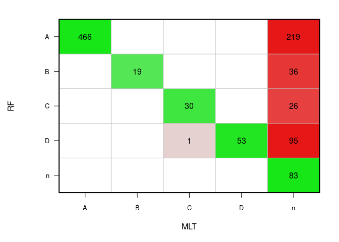

Assess HPV16 lineage using the new RF-based model
================
Laura Asensio Puig: <lasensio@idibell.cat>

24/02/2022

In this tutorial, you will find how to assess HPV16-lineage to a set of
complete or partially sequenced HPV16 genomes using the HPV16-lineage
RF-based model.

# Load the model and the HPV16 genomes

To predict HPV16 lineage with the following code you will need to
download the MODEL and the FUNCTIONS available at
<https://github.com/INCALAB-PREC/HPV16-linpred>.

``` r
##########################################
####        LOAD & PREPARE DATA       ####
##########################################

#Load libraries
suppressMessages(library(seqinr)) 
suppressMessages(library("caret"))
suppressMessages(library(evaluate)) 
suppressMessages(library(viridis))

# Define colors 
col_cc <- c("#EE7E33", "#9cc653")
col_lin <- viridis(5)
col_sublin <- viridis(13) 


### Folder organization ###
# PATH/
# - Codes/
#     -Functions.R
# - Data/
#     -PHENODATA.csv
#     -Aligned/
#       - Aligned_samples.fasta 
# - Model/
#     -HPV16_Lineage_MODEL_rf.Rdata

# PC_path <- "~PATH" #WRITE YOUR PATH HERE ****

wd_data <- paste(PC_path, "Data/", sep = "" )
wd_aligned <- paste(PC_path, "Data/Aligned/", sep = "" )
wd_model <- paste(PC_path, "Models/", sep = "" )
wd_results <- paste(PC_path, "Results/", sep = "" )

# LOAD THE FUNCTIONS:
source(paste(PC_path, "Codes/", "Functions.R", sep = "/"))

### LOAD THE MODEL:
model_name <- "HPV16_Lineage_MODEL_rf.Rdata"
load(paste(wd_model, model_name, sep = ""))
MODEL <- fit.rf; rm(fit.rf)

### LOAD AND READ HPV16 GENOMES IN FASTA FORMAT:
file_name <- "Aligned_HPV16_samples.fasta"
seq <- seqinr::read.fasta(paste(wd_aligned, file_name, sep = ""), seqtype = "DNA")
sequences <- getSequence(seq, as.string = FALSE)
```

**Remember:** samples must be aligned on the HPV16 reference genome
(GenBank Accession code: K02718.1). Use the bash script
1\_Align\_samples.sh to align all the samples over the HPV16 reference.

# Run the model

To run the model first we need to convert the fasta files into
data.frame, second to select the main 56 lineage-related SNPs and
finally use the model to predict the lineage.

## From Fasta to data.frame

``` r
### CONVERT THE SEQUENCES IN A DATAFRAME
GENOME <- setup.genome.df(sequences)
GENOME[GENOME == "-"] <- "n"
sequence_names <- getName(seq, as.string = FALSE)
sequence_names <- gsub("\\..*","",sequence_names)
rownames(GENOME) <- sequence_names
```

## Select linage-related SNPs

``` r
### SELECT THE SNPs
#Find the positions used in the model to filter the genome:
names <- gsub("`", "", MODEL$coefnames)
names <- substr(names, 4, nchar(names)-1) 
positions <- names[!duplicated(names)]; positions <- as.integer(positions)
positions <- positions[!is.na(positions)]; positions <- sort(positions)

#Select those positions in our samples (previously aligned!)
dataset <- GENOME[, as.character(positions)]
colnames(dataset) <- paste("snp", colnames(dataset), sep = "")
```

## Run the model

Before running the model, we need to find out whether random mutations
are caused by sequencing errors or are spontaneous mutations. The
following code excludes those random mutations.

``` r
### PREDICT LINEAGE
# Function to discard rare mutations not described in the model
Modifications <- NULL
while (length(grep("snp", as.character(evaluate("predict(MODEL, dataset)")[[2]]))) != 0) {
  message <-  as.character(evaluate("predict(MODEL, dataset)")[[2]])
  snp <- sub(".*factor ", "", message)
  snp <- sub("\\ has.*", "", snp)
  nt <- sub(".*levels ", "", message)
  nt <- substr(nt, 1, 1)
  ID <- rownames(dataset)[grep(nt, dataset[, snp])]
  # show(ID)
  if (length(ID) == 1){
    Modifications <- rbind(Modifications, c(snp, nt, ID))
    levels(dataset[,snp]) <- c(levels(dataset[,snp]),"n")
    dataset[ID, snp] <- "n"
  }else{
    for (i in 1:length(ID)){
      Modifications <- rbind(Modifications, c(snp, nt, ID[i]))
      levels(dataset[,snp]) <- c(levels(dataset[,snp]),"n")
      dataset[ID[i], snp] <- "n"
    }
  }
}

# Predict lineage to dataset samples using the MODEL 
predictions <- predict(MODEL, dataset)
table(predictions)
```

    ## predictions
    ##   A   B   C   D   n 
    ## 685  55  56 149  84

``` r
### WRITE FIRST CLASSIFICATION:
write.table(as.data.frame(x = predictions, row.names = IDs), 
            paste(wd_results, "Prediction_HPV16_samples.txt", sep = ""), sep = "\t", quote = F)
```

# Comparing prediction

Lineage was determined with a Maximum Likelihood Tree (MLT) to compare
results.

``` r
#Match phenodata with predictions
# names(predictions) <- ID
rownames(dataset) <- gsub("S", "", rownames(dataset))
names(predictions) <- rownames(dataset)

### LOAD PHENODATA:
pheno_file <- "PHENODATA_samples.csv"
pheno <- read.csv(paste(wd_data, pheno_file, sep = ""))
PHENO <- pheno[,c("ID", "LINEAGE_MLT", "SUBLINEAGE_MLT")]
colnames(PHENO) <- c("ID", "LINEAGE", "SUBLINEAGE")

#COMPARING  LINEAGE BETWEEN MODELS:
ML <- PHENO$LINEAGE
names(ML) <- PHENO$ID
comparitions <- data.frame(predictions, ML = ML[names(predictions)])
comparitions <- comparitions[!is.na(comparitions$ML),]

plot.cm(comparitions$predictions, comparitions$ML, rescales = F, xlab = "MLT", ylab = "RF")
```

<!-- -->

Most of the values had been predicted as MLT. The “n” column shows all
the samples that lineage has been assessed for the first time using the
new random forest model. Lineage could not be assigned with any method
in 87 out of 1029 samples.

``` r
# Accuracy, sensitivity and other parameters
(cm <- confusionMatrix(comparitions$predictions, comparitions$ML))
```

    ## Confusion Matrix and Statistics
    ## 
    ##           Reference
    ## Prediction   A   B   C   D   n
    ##          A 466   0   0   0 219
    ##          B   0  19   0   0  36
    ##          C   0   0  30   0  26
    ##          D   0   0   1  53  95
    ##          n   0   0   0   0  83
    ## 
    ## Overall Statistics
    ##                                          
    ##                Accuracy : 0.6333         
    ##                  95% CI : (0.603, 0.6628)
    ##     No Information Rate : 0.4533         
    ##     P-Value [Acc > NIR] : < 2.2e-16      
    ##                                          
    ##                   Kappa : 0.4373         
    ##                                          
    ##  Mcnemar's Test P-Value : NA             
    ## 
    ## Statistics by Class:
    ## 
    ##                      Class: A Class: B Class: C Class: D Class: n
    ## Sensitivity            1.0000  1.00000  0.96774  1.00000  0.18083
    ## Specificity            0.6103  0.96432  0.97392  0.90154  1.00000
    ## Pos Pred Value         0.6803  0.34545  0.53571  0.35570  1.00000
    ## Neg Pred Value         1.0000  1.00000  0.99897  1.00000  0.60212
    ## Prevalence             0.4533  0.01848  0.03016  0.05156  0.44650
    ## Detection Rate         0.4533  0.01848  0.02918  0.05156  0.08074
    ## Detection Prevalence   0.6663  0.05350  0.05447  0.14494  0.08074
    ## Balanced Accuracy      0.8052  0.98216  0.97083  0.95077  0.59041

``` r
### FILTER SAMPLES WITH LESS THAN 13 UNKNOWN SNPS
df <- dataset; df[df == "n"] <- NA
nt_sum <- unlist(lapply((apply(df, 1, table)),sum))
predictions[nt_sum < 13] <- "n"

comparitions <- data.frame(predictions, ML = ML[names(predictions)])
comparitions <- comparitions[!is.na(comparitions$ML),]

plot.cm(comparitions$predictions, comparitions$ML, rescales = F, xlab = "MLT", ylab = "RF")
```

<!-- -->

``` r
### WRITE FIRST CLASSIFICATION:
write.table(as.data.frame(x = predictions, row.names = IDs), 
            paste(wd_results, "Prediction_filtered_HPV16_samples.txt", sep = ""), sep = "\t", quote = F)
```

# References

Asensio-Puig L, Alemany L and Pavón MA 2022 **A Straightforward HPV16
Lineage Classification Based on Machine Learning**, Front. Artif.
Intell. 5:851841. doi: 10.3389/frai.2022.851841
